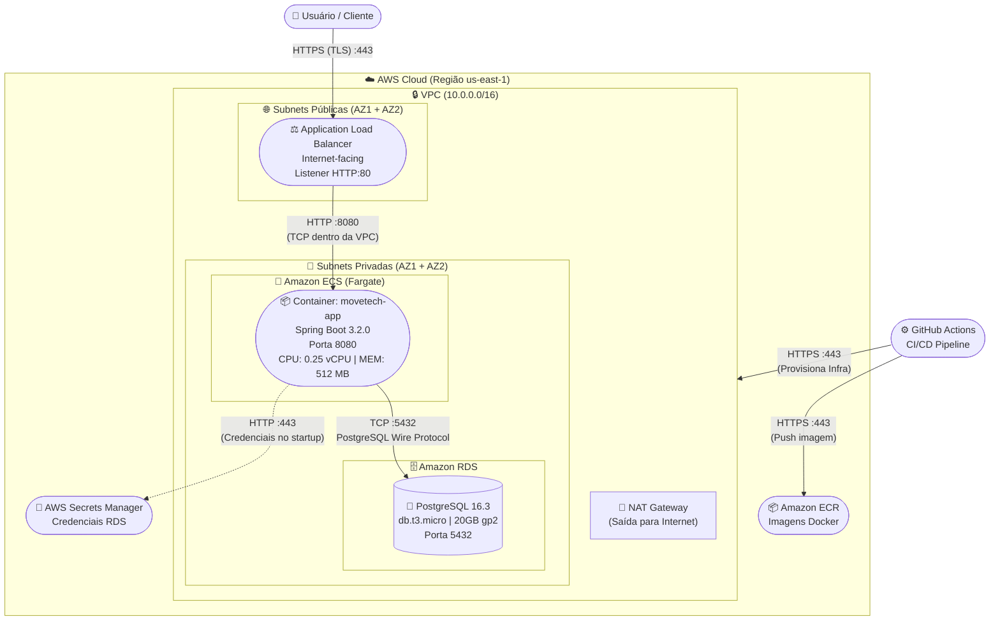

**Aluno:** Anne Bortoli de Oliveira
**Repositório do Projeto:** https://github.com/ANNEBORTOLI/move-tech-cloud-application-comp-6

# Documentação de Arquitetura da Solução - MoveTech

## 1. Mapeamento de Recursos

### 1.1. Serviços de Computação

- **Amazon ECS (Fargate):**
  - Cluster: `movetech-cluster`
  - Serviço: `movetech-service`
  - Definição da Task: 0.25 vCPU / 512 MB Memória
  - Container: `movetech-app` (imagem via ECR)
  - Porta exposta: 8080
  - Número desejado de Tasks: 1 (dev)

### 1.2. Balanceamento de Carga

- **Application Load Balancer (ALB):**
  - Tipo: Internet-facing
  - Listener: HTTP :80
  - Target Group: ECS Service (porta 8080)
  - Health Check: `/actuator/health`

### 1.3. Banco de Dados

- **Amazon RDS for PostgreSQL:**
  - Engine: PostgreSQL 16.3
  - Classe da Instância: db.t3.micro
  - Storage: 20 GB gp2
  - Multi-AZ: Desabilitado (dev)
  - Retenção de Backup: 7 dias
  - Credenciais: AWS Secrets Manager

### 1.4. Registro de Imagens

- **Amazon ECR (Elastic Container Registry):**
  - Repositório: `movetech-app`
  - Imagens versionadas por branch + commit SHA

### 1.5. Rede e Segurança

- **VPC:**
  - CIDR: 10.0.0.0/16
  - 2 Availability Zones
  - Subnets públicas (ALB)
  - Subnets privadas (ECS + RDS)
  - NAT Gateway (1 por AZ)
  - Internet Gateway

- **Security Groups:**
  - SG-ALB: Inbound HTTP :80 (0.0.0.0/0)
  - SG-ECS: Inbound HTTP :8080 (apenas SG-ALB)
  - SG-RDS: Inbound PostgreSQL :5432 (apenas SG-ECS)

### 1.6. Observabilidade

- Spring Boot Actuator (health check endpoints)
- CloudWatch Logs (ECS logging nativo)

### 1.7. CI/CD

- **GitHub Actions:**
  - Workflow: `build-and-push.yml` (Build + Push ECR)
  - Workflow: `terraform-deploy.yml` (Infra as Code)

### 1.8. Gerenciamento de Estado

- **Terraform Backend:**
  - S3 Bucket (state storage)
  - DynamoDB Table (state locking)

---

## 2. Diagrama C2 (Nível de Contêineres)

